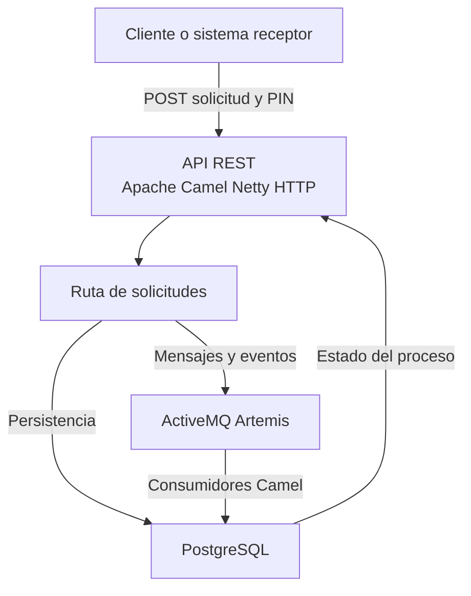
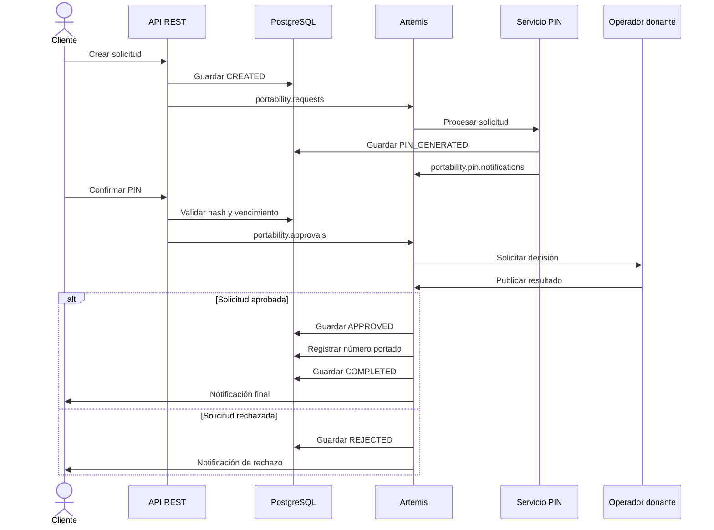
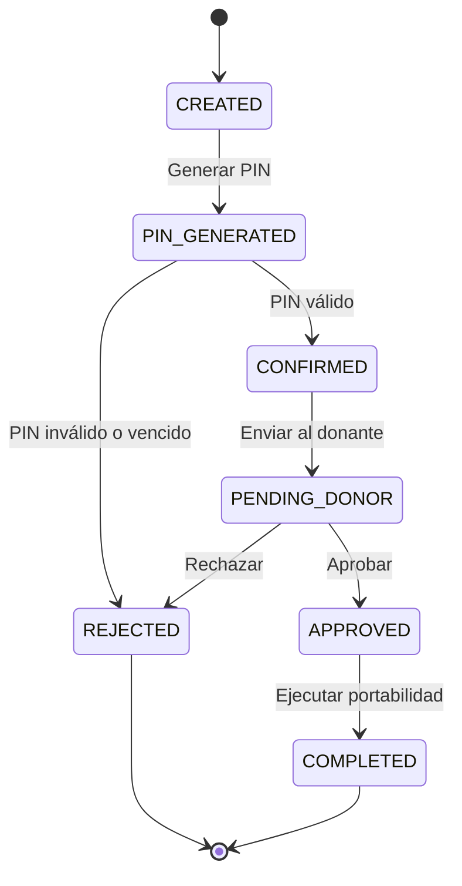
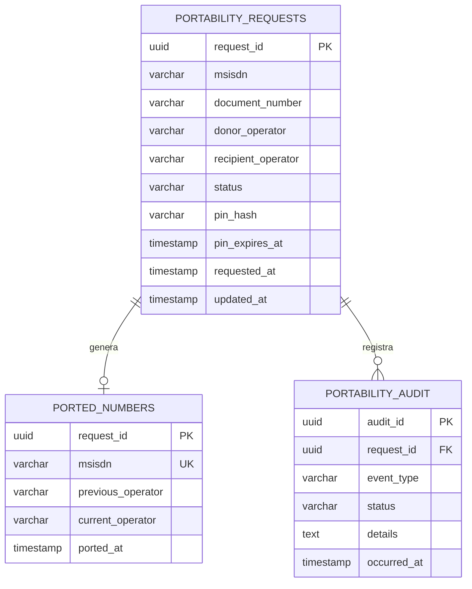

# Arquitectura de la EAPN

## Vista general

La EAPN implementa el proceso de portabilidad mediante APIs REST, rutas de Apache Camel, mensajería asíncrona con ActiveMQ Artemis y persistencia en PostgreSQL.



## Flujo de portabilidad



## Estados de la solicitud



## Canales de mensajería

| Destino | Tipo | Responsabilidad |
|---|---|---|
| `portability.requests` | Cola | Recibir solicitudes nuevas |
| `portability.pin.notifications` | Cola | Notificar el PIN generado |
| `portability.approvals` | Cola | Solicitar la decisión del operador donante |
| `portability.results` | Cola | Publicar el resultado del operador donante |
| `portability.recipient.notifications` | Cola | Notificar el resultado final |
| `portability.audit` | Cola | Persistir eventos de auditoría |
| `portability.errors.dlq` | Cola | Conservar mensajes que agotaron sus reintentos |
| `portability.status.events` | Tópico | Distribuir cambios de estado |

## Persistencia



## Manejo de errores

Los consumidores JMS tienen configurados reintentos automáticos. Cuando un mensaje no puede procesarse después de agotar los intentos permitidos, se envía a:

```text
portability.errors.dlq
```

Este mecanismo permite conservar el mensaje problemático, investigar su causa y evitar su pérdida.